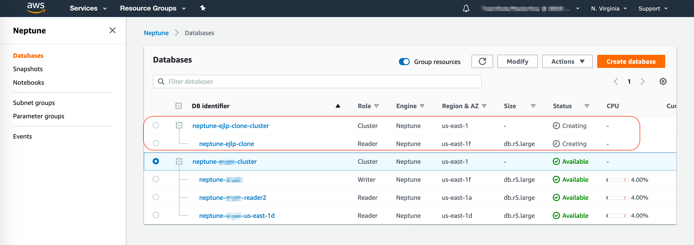

## Cloning Neptune Database

Create a clone copy of your Neptune database by performing the following steps:

1.	Go to the [Neptune Console](https://console.aws.amazon.com/neptune/home)
2.	Click on **Databases** 
3.	Select your DB cluster `neptune-{yourname}-cluster`
4.	Choose instance **Actions**
5.	Select **Create clone**
 
6.	Enter the following values
    - **DB instance class**: **db.r5.large**
    - Under **Settings**, for **DB Instance identifier** enter `neptune-{yourname}-clone`
    - Under **Network & Security**, leave all the fields as default
    - Under **Database options**, choose **Enable IAM DB authentication**
    - Leave all other fields to their default value
    
7.	Click **Create Clone**

    !!! Note ""
        It may take a few minutes for the clone to become Available and notice that the Role will start as Reader then change to Writer.

    


## Compare Primary and Cloned database

In this section, we will delete records from the primary database and validate that the delete operation does not affect the cloned database.

Perform the following tasks on your cloned cluster. 

1.  In your Cloud9, create a file `neptune-remote-clone.yml` in the folder `apache-tinkerpop-gremlin-console-3.4.1/conf` 
   
    ```
    host: [neptune-{YOUR_NAME}-cluster.xxxxxxxxxxxxxxx.{AZ_NAME}.rds.amazonaws.com]
    port: 8182
    connectionPool: { enableSsl: true, trustCertChainFile: "SFSRootCAG2.pem"}
    serializer: { className: org.apache.tinkerpop.gremlin.driver.ser.GryoMessageSerializerV3d0, config: { serializeResultToString: true }}    
    ```
   
2.  In the Cloud9 terminal, start your Gremlin console. 
   
    ```
    cd apache-tinkerpop-gremlin-console-3.4.1/bin
    ./gremlin
    ```

    Once you get prompt `gremlin>`, connect to new cloned cluster endpoint and try to count the Vertices and Edges

    ```
    :remote connect tinkerpop.server conf/neptune-remote-clone.yaml
    :remote console
    g.V.count()
    g.E.count()
    ```

Perform the the same thing on your original cluster to see the number of Vertices and Edges.

!!! Recap 
    Notice that the cloned records match the primary count prior to deletion. 
